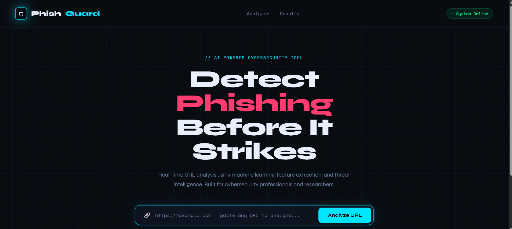
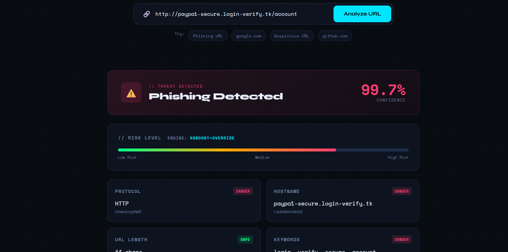
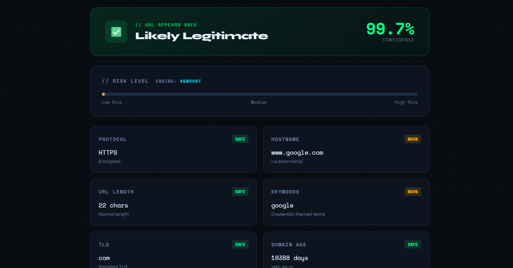

# 🛡️ PhishGuard — AI-Powered Phishing Detection System

<div align="center">

**Built for the 48-Hour Online Hackathon | Sai Vidya Institute of Technology**
**6th Semester ISE | 2024–25**

[](https://phishgaurd-pi.vercel.app)
[](https://phishguardd.onrender.com/api/v1/health)
[](https://python.org)
[](https://fastapi.tiangolo.com)
[](https://xgboost.readthedocs.io)

</div>

---

##  About the Hackathon

This project was built as part of the **48-Hour Online Hackathon** conducted by Sai Vidya Institute of Technology — a competitive innovation challenge where teams ideate, design, develop, and present a working MVP within 48 continuous hours.

- **Mode:** Online
- **Duration:** 48 Hours (online)
- **Eligibility:** 6th Semester ISE students, Sai Vidya Institute of Technology
- **Team Size:** 2–4 members

**Problem Statement we chose:**
> *Develop an AI-based system that detects phishing emails/URLs in real-time and alerts users.*

---

##  Problem Statement

Phishing is one of the most common and damaging cyberattacks today. Every day, thousands of people fall victim to fake websites and malicious URLs that look completely legitimate. Existing tools rely on static blacklists — which means a brand new phishing domain registered this morning won't be caught until it's manually reported and added to the list. That's too slow.

We wanted to build something smarter — a system that can detect phishing patterns in real time, even on URLs it has never seen before, by understanding the structural and behavioral characteristics that make a URL suspicious.

---

##  Solution Approach

We built **PhishGuard** — an end-to-end AI-powered phishing detection system that analyzes any URL in real time and tells you whether it's safe or a phishing attempt, along with a full explanation of why.

### How it works

1. **User pastes a URL** into the web interface
2. **Feature extraction** — we extract 22 structural and behavioral features from the URL (no need to visit the page)
3. **ML classification** — an XGBoost model trained on 20,000 URL samples predicts the phishing probability
4. **Rule-based scoring** — a transparent heuristic engine breaks the risk into 4 explainable categories
5. **SHAP explanations** — the top features driving the prediction are surfaced to the user
6. **Verdict + Alert** — the user gets a clear PHISHING / LEGITIMATE verdict with confidence score, risk meter, and detailed flags

### What makes it different

- Works on **brand new, never-seen domains** — not just known blacklisted URLs
- **Explains its reasoning** — you see exactly which features triggered the alert
- **Real-time** — full analysis in under 500ms

---

##  Screenshots

> **Homepage — URL Analyzer**



> **Phishing Detected — Result View**



> **Safe URL — Result View**



>
---

## 🧠 ML Model Details

| Property | Value |
|----------|-------|
| Algorithm | XGBoost (GradientBoostingClassifier fallback) |
| Training samples | 20,000 (10k legit + 10k phishing) |
| Features | 22 lexical + behavioral URL features |
| Test AUC-ROC | ~0.97–0.99 |
| Explainability | SHAP values per prediction |
| Calibrated against | Mohammad et al. (2016), Sahingoz et al. (2019), APWG eCrime Reports |

### Risk Score Breakdown

Every URL gets scored across 4 categories:

| Category | Max Score | What it checks |
|----------|-----------|----------------|
| URL Structure | 40 | Length, hyphens, IP usage, subdomains, encoding tricks |
| Domain Intelligence | 35 | TLD risk, brand impersonation, domain age (WHOIS) |
| Content Analysis | 15 | Suspicious keywords, URL entropy |
| Behavioral Signals | 10 | DNS resolution, port anomalies |

Final risk score = `(ML probability × 60) + (rule score × 0.4)`

---

##  Tech Stack

| Layer | Technology |
|-------|-----------|
| Frontend | HTML, CSS, JavaScript |
| Backend | Python, FastAPI |
| ML Model | XGBoost, scikit-learn |
| Explainability | SHAP |
| Domain Intel | python-whois, socket (DNS) |
| Frontend Hosting | Vercel |
| Backend Hosting | Render |
| Version Control | Git, GitHub |

---

##  Project Structure

```
PHISHING/
│
├── PHISHGAURD.html          ← Frontend web app
├── requirements.txt         ← Python dependencies
├── Procfile                 ← Render deployment config
├── render.yaml              ← Render service config
├── vercel.json              ← Vercel static site config
├── README.md                ← This file
│
├── app/
│   ├── __init__.py
│   ├── main.py              ← FastAPI app + /api/v1/analyze endpoint
│   ├── features.py          ← URL feature extractor (22 features)
│   ├── scorer.py            ← Rule-based risk scorer + flag generator
│   └── train_model.py       ← Dataset builder + XGBoost training
│
├── screenshots/             ← Add your screenshots here
│
└── phishguard
    ├── manifest.json
    ├── background.js        ← Service worker + API calls
    ├── content.js           ← Link interceptor + popup alerts
    ├── popup.html           ← Extension popup UI
    └── icons/
```

---

##  Setup Instructions

### Prerequisites

- Python 3.10 or above
- pip
- Git

### 1. Clone the repository

```bash
git clone https://github.com/akshithaaballal/phishguard.git
cd phishguard
```

### 2. Install dependencies

```bash
pip install -r requirements.txt
```

### 3. Train the ML model

```bash
python -m app.train_model
```

This generates a 20,000-sample dataset and trains the XGBoost model. Takes about 30–60 seconds. The trained model is saved to `app/model/`.

### 4. Start the backend server

```bash
uvicorn app.main:app --reload --port 8000
```

You should see:
```
✅ Loaded ML model (xgboost)
INFO:     Application startup complete.
```

### 5. Open the frontend

Open `PHISHGAURD.html` directly in your browser. It connects to `http://localhost:8000` automatically.

---

##  Deployment

| Service | URL |
|---------|-----|
| Frontend (Vercel) | https://phishgaurd-pi.vercel.app |
| Backend API (Render) | https://phishguardd.onrender.com |
| API Health Check | https://phishguardd.onrender.com/api/v1/health |
| API Docs (Swagger) | https://phishguardd.onrender.com/docs |

> **Note:** The backend runs on Render's free tier and may take 30–60 seconds to wake up after inactivity. Just hit the health check URL first if it seems slow.

---

##  API Reference

### `POST /api/v1/analyze`

Analyzes a URL and returns a full phishing risk report.

**Request:**
```json
{
  "url": "http://paypa1-secure.login-verify.tk/account"
}
```

**Response:**
```json
{
  "verdict": "PHISHING",
  "confidence": 0.947,
  "risk_score": 87,
  "engine": "xgboost",
  "breakdown": {
    "url_score": 22,
    "domain_score": 27,
    "content_score": 12,
    "behavioral_score": 5
  },
  "flags": [
    { "severity": "red", "title": "No HTTPS", "description": "..." },
    { "severity": "red", "title": "High-Abuse TLD (.tk)", "description": "..." },
    { "severity": "red", "title": "Brand Impersonation", "description": "..." }
  ],
  "shap_values": {
    "brand_impersonation": 0.412,
    "tld_is_high_risk": 0.380
  },
  "extraction_time_ms": 184
}
```

### `GET /api/v1/health`

Returns backend status and whether the ML model is loaded.

---

##  Known Limitations

We built this in 48 hours so here's what we know could be better:

- Trained on synthetic data — a real-world dataset like UCI Phishing or Kaggle's Web Page Phishing Detection Dataset would improve accuracy further
- WHOIS lookups sometimes fail for privacy-protected domains
- The Render free tier sleeps after 15 minutes of inactivity
- Currently analyzes URLs only — email body scanning would be a natural next step

---

##  Future Scope

- Integrate Google Safe Browsing API and VirusTotal for cross-referencing
- Add email body scanning (Gmail plugin)
- Train on larger real-world datasets
- Add user feedback loop to improve the model over time
- Browser history-aware scoring (flag domains you've never visited)

---

## 👥 Team

Built with very little sleep during the 48-hour hackathon window.

| Name | Role |
|------|------|
|  Akshithaa Ballal  | 1VA23IS006 |
| Akarsh Sujay Kumar | 1VA23IS004 |
|       Ananya R     | 1VA23IS009 |
|     Devraj M P     | 1VA23IS022 |

**Institution:** Sai Vidya Institute of Technology
**Department:** Information Science & Engineering
**Semester:** 6th Semester

---

## 📚 References

- Mohammad, R. M., et al. (2016). *UCI ML Phishing Websites Dataset.*
- Sahingoz, O. K., et al. (2019). *Machine learning based phishing detection from URLs.* Expert Systems with Applications.
- APWG eCrime Reports (2020–2024)
- Spamhaus Domain Reputation Data

---

<div align="center">
<sub>Built for the 48-Hour Hackathon · Sai Vidya Institute of Technology · ISE 6th Sem</sub>
</div>
